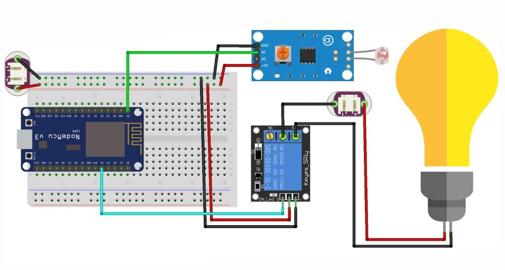
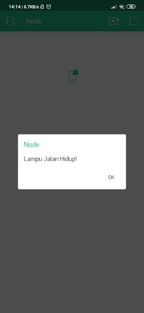

# IoT Project: Blynk Smart Street Lighting

## Description:

This project uses an ESP8266 microcontroller and the Blynk platform to create a smart street lighting system. The system automatically controls the street light based on ambient light levels detected by a Light Dependent Resistor (LDR). When the ambient light falls below a certain threshold, the street light turns on, and when it exceeds the threshold, the light turns off. Notifications are sent to the Blynk app to inform the user about the status of the street light.

## Components (Tools & Materials):

- ESP8266 WiFi Module (e.g., NodeMCU) = 1 unit
- Light Dependent Resistor (LDR) = 1 unit
- Relay Module = 1 unit
- Breadboard and Jumper Wires

## Circuit Schematic:



## Wiring Information:

- LDR Pin to Analog Pin A0
- Relay Module:
  - VCC to 3.3V
  - GND to GND
  - IN to Digital Pin D4 (GPIO 2)

## Blynk Settings:

- Use Notification type Widget Box: <br/>
   <br/>
  Notification Box Widget selection image. <br/>

## Sketch Program:

```cpp
#define BLYNK_PRINT Serial
#include <ESP8266WiFi.h>
#include <BlynkSimpleEsp8266.h>

char auth[] = "XXXX";               // Enter your Blynk authentication token here
char ssid[] = "Veendy-Suseno";      // Your WiFi SSID
char pass[] = "Admin12345";         // Your WiFi password

int pinLDR = A0;                    // LDR pin
int rel = 2;                       // Relay pin (D4)
int lampuON = LOW;
int lampuOFF = HIGH;
int nilai;                         // LDR value
int kondisi = 0;                   // Light state condition

void setup() {
    Serial.begin(9600);
    pinMode(rel, OUTPUT);
    digitalWrite(rel, lampuOFF);   // Ensure the light is off initially
    Blynk.begin(auth, ssid, pass); // Connect to Blynk server
}

void loop() {
    nilai = analogRead(pinLDR);    // Read LDR value
    Serial.println(nilai);         // Print LDR value to Serial Monitor

    if (nilai < 180 && kondisi == 0) {  // If ambient light is low
        digitalWrite(rel, lampuON);    // Turn on the street light
        Blynk.notify("Street Light ON!"); // Notify via Blynk app
        kondisi = 1;                  // Update the condition
    }

    if (nilai > 180 && kondisi == 1) {  // If ambient light is high
        digitalWrite(rel, lampuOFF);   // Turn off the street light
        Blynk.notify("Street Light OFF!"); // Notify via Blynk app
        kondisi = 0;                  // Update the condition
    }

    Blynk.run();                       // Run Blynk server
}
```

## Interface:

<br/>

## Conclusion:

- This IoT project uses the ESP8266 and Blynk to automate street lighting based on ambient light levels. The system reads the light level using an LDR and controls a relay to switch the street light on or off. Notifications are sent to the Blynk app to keep users informed about the light status. This project demonstrates how IoT and cloud-based notifications can enhance smart home and street lighting systems.

- In this project, if the intensity of sunlight hitting this sensor decreases, the output from the LDR will be read by the NodeMCU and the lighting will activate itself and will provide a notification to the light blynk application that it is on. If the intensity of sunlight hitting this sensor increases, the output from the LDR will be read by the Arduino and the lighting will turn itself off.
